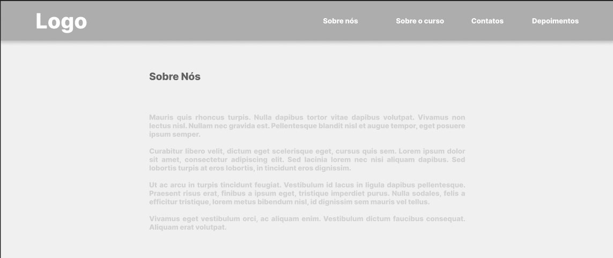
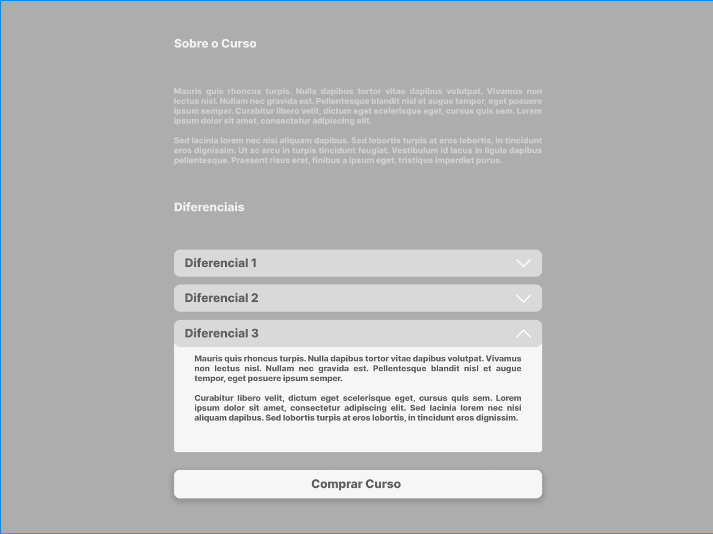
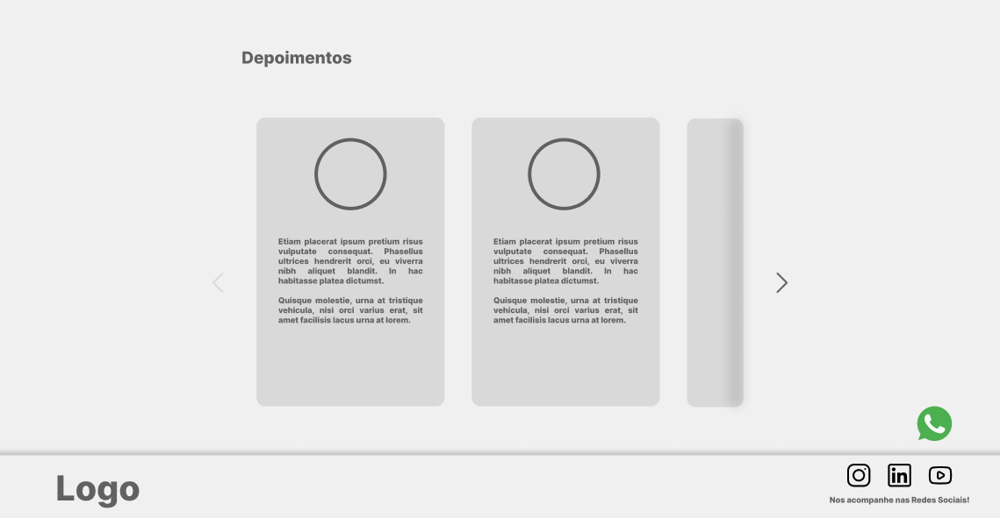

**
 <h1>Desafio de Projeto DIO - Wireframe Média Fidelidade</h1> 
**
 

Espaço dedicado a apresentação do primeiro Desafio de Projeto da Formação US Designer da DIO. 
 

O desafio consiste em elaborar um wireframe de média fidelidade, apresentando um site de venda de algum produto/serviço aplicando os conceitos aprendidos no curso até o momento. Para isso, optei por apresentar um site para venda de um curso. Abaixo apresento as sessões montadas para o wireframe, bem como os conceitos.:

 

<a href="https://www.figma.com/design/s6MBWnQgf6ArosrUju0ace/Desafio-de-projeto-DIO?node-id=0-1&t=UYBnJmjFcNob2EVj-1">CLIQUE AQUI PARA IR AO PROJETO NO FIGMA</a>

 

A proposta de um wireframe é apresentar uma ideia de projeto a ser debatida com o cliente final, ilustrando um esqueleto do que seria a entrega. Para isso, há 3 tipos de wireframe a depender do andamento do processo, sendo.:

- Baixa Fidelidade.: Wireframe mais simples, podendo ser elaborado ainda na primeira conversa como um rabisco em papel, organizando os espaços dos elementos mas ainda sem muito foco em detalhes esteticos.
- Média Fidelidade.: Wireframe ainda simples, porém elaborado com auxilio de alguma ferramenta mais formal (figma neste caso) - São organizados os elementos visuais/textuais, espaços e sessões.
- Alta Fidelidade.: Wireframe que se aproxima mais do projeto final, definem-se as cores do projeto, conteúdo dos textos que serão trabalhados no projeto e definição mais concreta dos elementos que estarão presente. 

 

Abaixo estamos trabalhando com um Wireframe de Média Fidelidade, conforme veremos em cada sessão.:

**
<h2>Cabeçalho e Sessão Hero<h2>
**

Foram dispostos no cabeçalho a logo (representado pelo texto "Logo") e um menu de guia/navegação pelo site. No decorrer do projeto, serão trabalhados elementos de hover para os textos dos menus, bem como links para cada sessão da página.

Quando o usuário rolar a página para baixo, o cabeçalho se mantém fixo e torna a cor de fundo transparente, mantendo apenas a logo e  menu de guia/navegação visíveis/disponíveis ao decorrer de toda a página.

**
<h2>Sobre o Curso<h2>
**

Nesta sessão, apresenta-se o curso e os diferenciais. 

Para os diferenciais, ficam estes dispostos em um elemento tipo "acordeão" em que conforme clicado, os detalhes sobre aquele diferencial são expandidos e apresentados. 

 

Cada diferencial é lido de uma vez, de modo que não seja possível ficar com mais de um elemento aberto de uma única vez.

Por fim, nesta sessão também fica disposto um botão para a compra do curso, elemento este que terá um hover alterando sua cor e tamanho.

**
<h2>Depoimentos e Rodapé<h2>
**

Nesa última sessão, apresentamos a logo e links para as redes sociais no rodapé e depoimentos de pessoas que já compraram o curso, dispostos em um carrossel. Em cada extremidade do carrossel, é apresentado uma flecha para navegação, em que quando não houver elementos a serem vistos para o lado em questão, ficará em uma cor mais apagada (ilustrado no lado esquerdo).

Nesta sessão vale mencionar também o ícone do *whatsapp* que ficará fixo durante toda a página no lado inferior direito.

Disponibilizo aqui mais uma vez o link de acesso ao projeto no Figma.:

<a href="https://www.figma.com/design/s6MBWnQgf6ArosrUju0ace/Desafio-de-projeto-DIO?node-id=0-1&t=UYBnJmjFcNob2EVj-1">CLIQUE AQUI PARA IR AO PROJETO NO FIGMA</a>